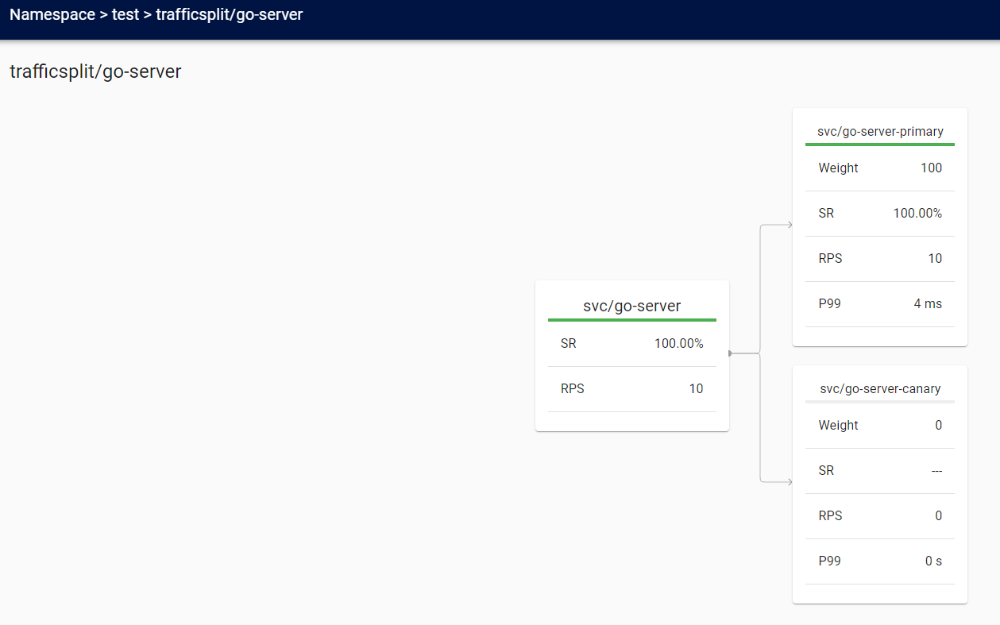

# linkerd-automated-canary



## Install Linkerd
https://linkerd.io/2/getting-started/

## Install Flagger
While Linkerd will be managing the actual traffic routing, Flagger automates the process of creating new Kubernetes resources, watching metrics and incrementally sending users over to the new version. To add Flagger to your cluster and have it configured to work with Linkerd, run:

```shell
$ kubectl apply -k github.com/weaveworks/flagger/kustomize/linkerd
```

This command adds:

- The canary CRD that enables configuring how a rollout should occur.
- RBAC which grants Flagger permissions to modify all the resources that it needs to, such as deployments and services.
- A controller configured to interact with the Linkerd control plane.

To watch until everything is up and running, you can use kubectl:
```shell
$ kubectl -n linkerd rollout status deploy/flagger
```

## Deploy

```shell

# Create the namespace
$ kubectl create namespace test

# Deploy the Go server
$ kubectl apply -f go-server-deployment.yaml

# Deploy the load generator
$ kubectl apply -f load-deployment.yaml 

# Deploy the Canary configuration
$ kubectl apply -f canary.yaml

# Perform a first deployment update (this server will return 200 OK) 
$ kubectl -n test set image deployment/go-server go-server-ctr=felipecruz/go-server:ok

# Behind the scenes, Flagger is splitting traffic between the primary and canary backends by updating the traffic split resource.
# To watch how this configuration changes over the rollout, run:
$ kubectl -n test get trafficsplit podinfo -o yaml

# Monitor the canary deployment via the Linkerd dashboard or the CLI
$ kubectl -n test get canary -o wide

# Perform a second deployment update (this image will return 500 Internal Server Error on purpose to simulate a bug)
$ kubectl -n test set image deployment/go-server go-server-ctr=felipecruz/go-server:error        

# Monitor the canary deployment via the Linkerd dashboard or the CLI
$ kubectl -n test get canary -o wide
```

## References

- [Linkerd Canary Release](https://linkerd.io/2/tasks/canary-release/)
